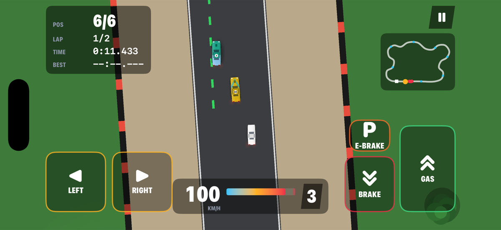
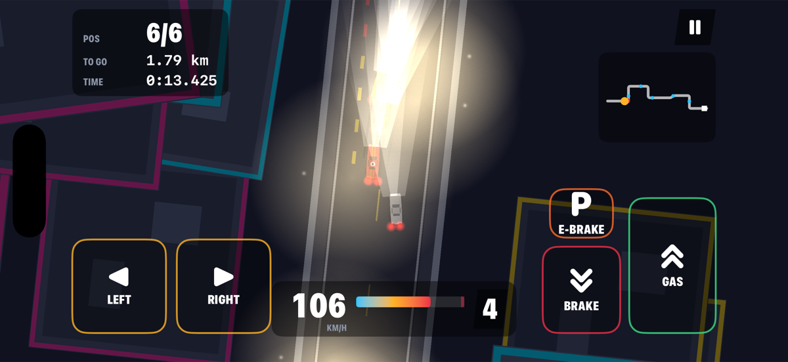
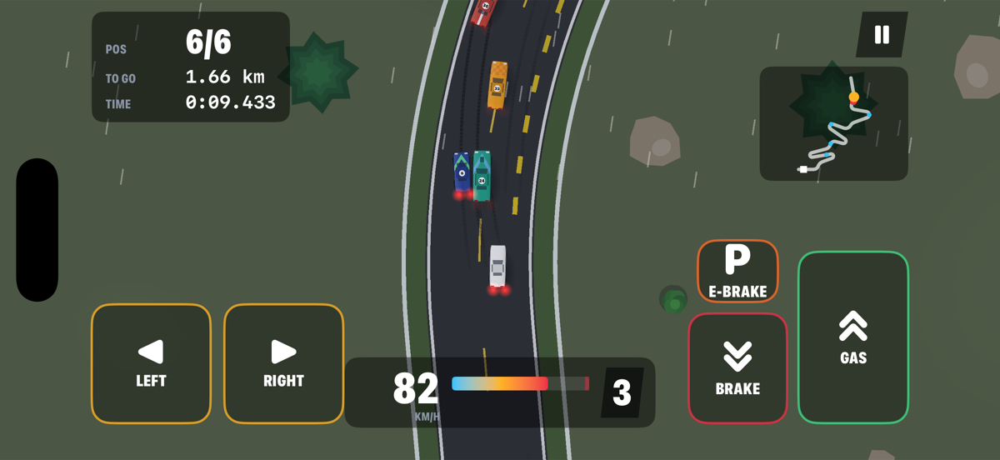
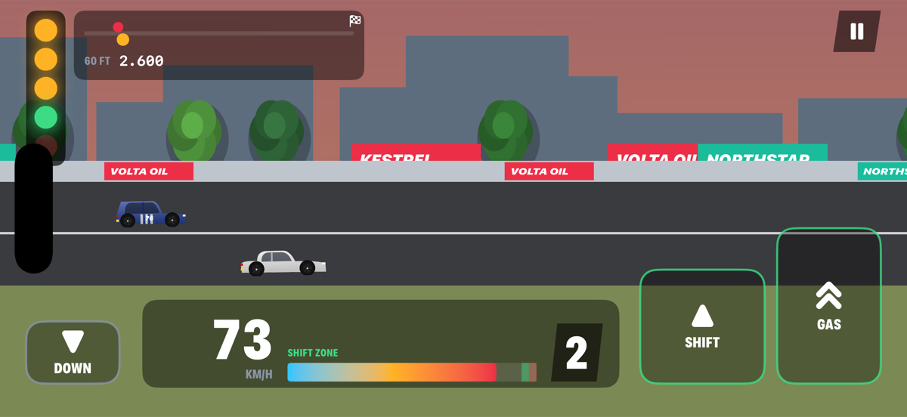
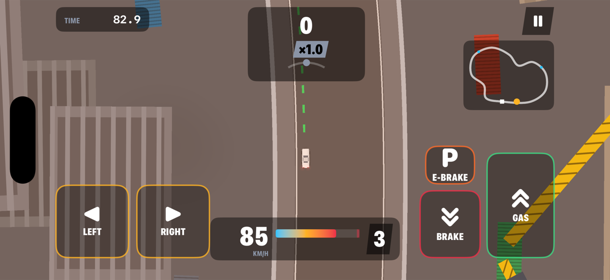
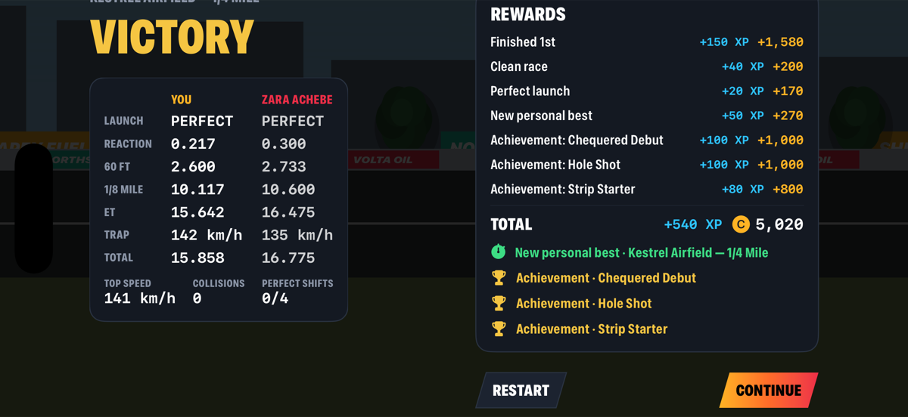
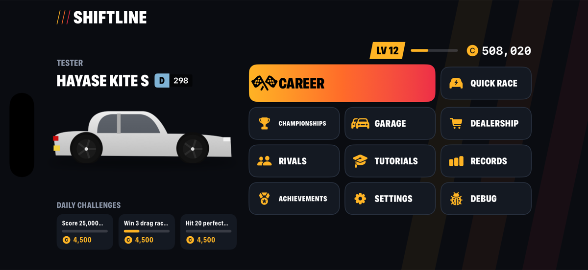

# Shiftline

Shiftline is a multi-discipline racing game for iPhone and iPad. Build a garage of fictional cars and master circuit racing, street sprints, mountain passes, drag strips and drift yards — each with its own feel, its own rivals and its own route through a seven-tier career.

Written natively in Swift with SwiftUI, SpriteKit, AVFoundation and Core Haptics. No third-party dependencies.

| | |
|---|---|
|  |  |
|  |  |
|  |  |



## Features

- **Driving model** — a bicycle-model simulation with per-axle friction ellipses, load transfer, torque curves, turbo lag, superchargers, nitrous, rev limiter and gradients. FWD pushes wide under power, RWD rotates and drifts, AWD launches and exits corners hardest.
- **Manual or automatic gearbox** — every gear change is rated PERFECT, GOOD, EARLY or LATE. Perfect shifts are quicker and give a brief pull; the automatic shifts slightly early.
- **Drag launch system** — rev into the car's traction-limited launch window, react to the tree, then shift. Launches are rated PERFECT / GOOD / OK / BOGGED / WHEELSPIN, with reaction, 60 ft, 1/8 mile, ET and trap speed on the timeslip.
- **Drift scoring** — angle × speed × time × combo, with wall proximity, clipping points, transition bonuses, sustained-drift multipliers and chain loss on spins, crashes or leaving the course.
- **AI drivers** — follow a minimum-curvature racing line with braking points from a per-car speed profile, overtake around slower cars, defend, avoid contact and recover from crashes. Drivers have styles (aggressive, defensive, clean, late braker, metronome) and skill levels. They drive the same physics as you: no extra power, no teleporting and no rubber-banding. Difficulty changes their skill, never their cars.
- **Career** — 92 events across seven tiers (Rookie Cup → Legend Series) and six disciplines, with class caps, drivetrain and body-style restrictions, prerequisite events and visible requirements.
- **Rivals** — six named rivals with personalities, specialties and cars that grow with the career, each met three times.
- **Starts and slipstream** — hit the gas as "2" appears for a rocket start (too early and the wheels just spin); tuck in behind a rival to charge a slipstream slingshot.
- **Championships** — nine multi-round series, including the Drift Masters, scored 25-18-15-12-10-8-6-4 with win and count-back tie-breaks. Off-screen competitors in drag, time-attack and drift rounds make real simulated runs.
- **27 cars from 7 fictional manufacturers** — hatchbacks, coupes, sedans, muscle cars, sports cars, roadsters, supercars, hypercars and lightweight track cars, classed D to X by a measured performance index.
- **Upgrades and tuning** — 15 upgrade categories over four levels (Street, Sport, Race, Pro) that can be removed again for 55% of their price, five tyre compounds, turbo or supercharger kits for naturally aspirated cars, drivetrain conversions, and tuning of final drive, individual gears, diff lock, balance, ride height, tyre pressure, brake bias, steering and AWD split, with Drag/Grip/Drift/Top Speed presets.
- **Customisation** — paint, accent colour and finish, nine liveries (some unlocked by level), six wheel styles, window tint, race number and plate.
- **Tracks** — ten original environments and 34 layouts including reverse and short variants, point-to-point routes, drift yards and four drag strip lengths. Surfaces, run-off and weather change the grip: rain is genuinely slippery.
- **Progression** — driver level with XP, event and achievement credits, clean-race, overtake, perfect-shift, fastest-lap, drift-combo and personal-best bonuses, 45 achievements and three date-seeded daily challenges.
- **Records** — statistics, personal bests per track, discipline and car, a leaderboard across every profile on the device, global Game Center leaderboards (one per track; see `docs/LEADERBOARDS.md` for the one-off setup), and time attack ghosts.
- **Presentation** — procedural car and scenery art, chunked SpriteKit track rendering, day/sunset/night lighting with headlights and street lamps, rain and fog, tyre smoke, skid marks, sparks, speed streaks, camera shake and a speed-sensitive chase camera. A side-on parallax scene for drag racing.
- **Audio and haptics** — engine voices synthesised from RPM, cylinder count, load and boost, tyre squeal, wind, generated sound effects, a procedural soundtrack (replaceable with bundled `music_<style>.m4a` files) and Core Haptics feedback for shifts, launches, impacts, kerbs, wheelspin and finishes.
- **Controls** — touch zones, a steering wheel, a floating swipe stick or tilt steering; left-handed layout; assists for gearbox, traction, stability, ABS, steering, braking and a colour-coded racing line.
- **Saves** — several profiles, versioned JSON saves with atomic writes, a rolling backup and recovery from corrupt files.

## Race modes

| Mode | Summary |
|---|---|
| Circuit | Multi-lap grid race with track-limit penalties |
| Sprint | Point to point on city, industrial, forest, coast and desert roads |
| Street | Night sprints and ring-road races on closed city streets |
| Touge / Mountain | Uphill and downhill switchbacks with gradient physics |
| Drag | 1/8, 1/4, 1/2 mile and standing kilometre, heads-up |
| Drift | Score attack, drift sections, drift chain and tandem |
| Time Attack | Solo laps with sector times, theoretical best and ghost |
| Elimination | Last place is out every lap |
| Checkpoint | Beat the clock; checkpoints add time |
| Speed Trap | Trap speeds plus an average-speed zone |
| Endurance | Long races with tyre wear |
| Rival duel | Head-to-head against a named rival |
| Championship | Multi-round, mixed-discipline series |
| Free Drive | Unlimited laps with timing |

## Running

Requirements: Xcode 26 or later, iOS 17 or later.

```bash
open Shiftline.xcodeproj
```

Choose the **Shiftline** scheme and an iPhone simulator, then run. From the command line:

```bash
scripts/build.sh
```

## Testing

```bash
scripts/build.sh test "iPhone 17 Pro" -only-testing:ShiftlineTests
```

The unit suite (Swift Testing) covers vehicle physics, drag launches, track geometry, laps, checkpoints, wrong-way detection, fixed-timestep determinism, collisions, every race mode's rules, drift scoring, the garage economy, upgrades, tuning, progression, championships, achievements, persistence and content integrity. The UI suite (XCUITest) covers the first-run flow, buying a car, entering an event and finishing a race.

Debug builds accept launch arguments for automated checks: `-debugProfile` (ready-made profile), `-debugRace <track> <mode>` (start a race), `-debugAutopilot` (AI drives your car), `-debugTime`, `-debugWeather` and `-debugFPS`. `scripts/screenshots.sh` uses them to regenerate the images above.

## Controls

| Control | Default |
|---|---|
| Steer | LEFT / RIGHT touch zones (wheel, swipe or tilt in Settings) |
| Accelerate / brake | GAS and BRAKE pedals on the right |
| Reverse | Hold BRAKE while stopped |
| Handbrake | E-BRAKE — kick the rear out to start a drift |
| Nitrous | N2O (once fitted) |
| Shift | UP / DOWN with the manual gearbox |
| Drag | Hold GAS to rev, LAUNCH on green, SHIFT in the green zone |

## Project structure

```
Shiftline/
  App/          App entry, GameStore (state + persistence), debug launch
  Core/         Vector maths, seeded random, units
  Physics/      VehicleSpec, VehicleState, VehicleModel (dynamics + gearbox)
  Tracks/       Layout description and TrackGeometry (splines, projection, racing line)
  Racing/       RaceSession, RaceCar, DragRace, DriftScorer, ghosts, race config
  RaceModes/    RaceMode protocol and each mode's rules
  AI/           AIDriver
  Garage/       Owned cars, upgrades → spec build, tuning, appearance, performance index
  Career/       Progression, rewards, garage rules, championships, daily challenges, race factory
  Data/         Cars, Tracks, Events, Opponents, Upgrades, Achievements, Championships
  Persistence/  Save data, save store, leaderboards
  Audio/        Engine/tyre/music synthesis, sound effects, haptics
  Render/       SpriteKit scenes, car and scenery art, track renderer, effects
  UI/           SwiftUI screens, race HUDs and controls
ShiftlineTests/    Unit tests
ShiftlineUITests/  UI tests
docs/              Architecture, progress, roadmap, balancing
scripts/           Build, install and screenshot helpers
```

See [docs/ARCHITECTURE.md](docs/ARCHITECTURE.md) for how the pieces fit together, [docs/BALANCING.md](docs/BALANCING.md) for the numbers, [docs/PROGRESS.md](docs/PROGRESS.md) for current status and [docs/ROADMAP.md](docs/ROADMAP.md) for what comes next.
